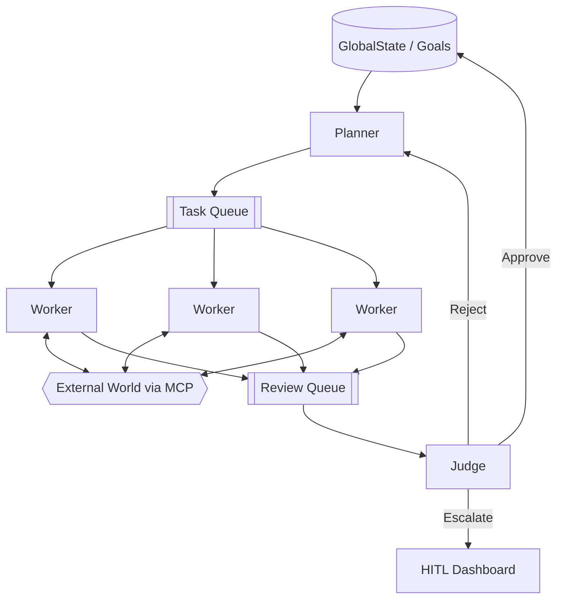
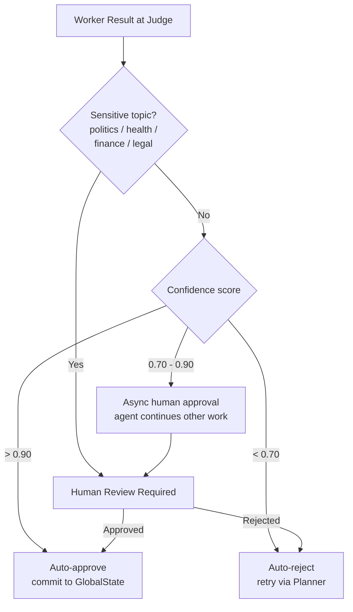
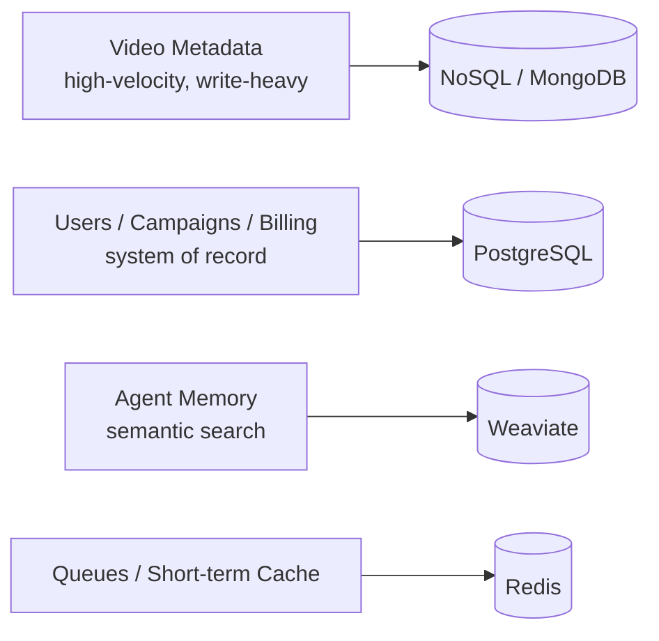

# Project Chimera — Architecture Strategy

*Day 1 Deliverable*

This document records three foundational architecture decisions for Project Chimera. Each decision is presented with its reasoning and its trade-off. Diagrams are provided in Mermaid for inline rendering.

---

## 1. Agent Pattern: Hierarchical Swarm vs. Sequential Chain

**Decision.** Adopt a **Hierarchical Swarm** built on the **Planner–Worker–Judge** model rather than a linear, sequential agent chain.

**Reasoning.** A sequential chain is brittle and serial: a single failed step halts the entire pipeline, and there is no way to fan work out across many agents at once. Chimera must operate at the opposite end of that spectrum — running thousands of agents and many parallel tasks simultaneously. The Hierarchical Swarm meets this need by separating concerns across three roles:

- **Planner** — decomposes high-level goals into discrete, independent tasks and performs **dynamic re-planning** when results come back (or fail).
- **Workers** — **stateless** executors that pull tasks off a queue and run them **in parallel**, calling the external world through MCP.
- **Judge** — gates **quality and safety on every result** before it is committed, acting as the system's single, consistent checkpoint.

Because Workers are stateless and the Planner can re-plan dynamically, the swarm degrades gracefully: a failed task is re-queued or re-planned rather than collapsing the whole run.

**Trade-off.** The swarm introduces **more coordination overhead** — a task queue and shared global state must be maintained and synchronized — in exchange for **horizontal scale and a mandatory safety gate** on every output. We accept the coordination cost because scale and safety are non-negotiable for Chimera.

**Java mapping.**

- **Planner / Worker / Judge** implemented as **decoupled services**, communicating via the task and review queues.
- **Java 21 Virtual Threads** to run the parallel Workers cheaply — one lightweight thread per task rather than a bounded OS-thread pool.
- **Java Records** as **immutable `Task` / `Result` DTOs**, passed between services without shared-mutable-state hazards.
- **Optimistic Concurrency Control** at the Judge, so concurrent commits to global state are detected and resolved without coarse locking.

---

## 2. Human-in-the-Loop: Where the Human Approves

**Decision.** Place the Human-in-the-Loop (HITL) checkpoint **at the Judge stage**, gated by a **confidence score** and surfaced through a **dashboard review queue**.

Confidence tiers:

| Confidence score | Action |
| --- | --- |
| **> 0.90** | **Auto-approve** — commit to global state |
| **0.70 – 0.90** | **Async human approval** — queued to the dashboard; the agent continues other work meanwhile |
| **< 0.70** | **Auto-reject and retry** — returned to the Planner for re-planning |

**Override.** **Sensitive topics — politics, health, finance, legal — always require human review**, regardless of confidence score.

**Reasoning.** This design **balances velocity with safety**. High-confidence, low-risk results flow through automatically so throughput stays high, while uncertain results are escalated asynchronously rather than blocking the agent. The **Judge is the natural checkpoint** because it already inspects every Worker output — adding HITL there means no new inspection point is introduced, and human review piggybacks on a gate that already exists. The async middle tier is the key to maintaining throughput: a result awaiting human approval parks in the queue while the agent moves on to other tasks.

---

## 3. Database: SQL vs. NoSQL for High-Velocity Video Metadata

**Decision.** Use **polyglot persistence**, matching each data type to the store that fits its access pattern:

- **Video metadata (high-velocity)** → **Document / NoSQL store (e.g., MongoDB)**
- **Users, campaigns, billing (system of record)** → **PostgreSQL**
- **Semantic agent memory** → **Weaviate** (vector store)
- **Queues / short-term cache** → **Redis**

**Reasoning.** Video metadata is **write-heavy** and arrives with a **platform-varying schema** — different sources expose different fields and shapes. This profile suits NoSQL's strengths: high **write throughput**, a **flexible schema** that absorbs structural variation without migrations, and **horizontal scaling**. By contrast, relational and transactional data — users, campaigns, billing — depends on **referential integrity, joins, and transactional guarantees**, which is exactly what PostgreSQL provides as the system of record. Agent memory is best served by semantic/vector search (Weaviate), and ephemeral coordination state (task queues, short-term cache) belongs in Redis.

**Trade-off.** **NoSQL trades strong joins and strong consistency for write speed and schema flexibility**; **SQL trades write scalability for integrity and rich relational querying.** Polyglot persistence lets each workload sit on the side of that trade-off that suits it, at the cost of operating more than one datastore.

---

## Summary

| Decision | Choice | Core trade-off |
| --- | --- | --- |
| Agent pattern | Hierarchical Swarm (Planner–Worker–Judge) | Coordination overhead for scale + safety gate |
| Human-in-the-Loop | At the Judge, confidence-gated + sensitive-topic override | Some latency on mid-confidence results for safety |
| Persistence | Polyglot (NoSQL + PostgreSQL + Weaviate + Redis) | Operating multiple stores to fit each workload |
