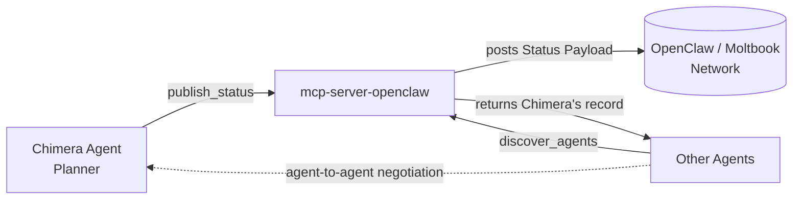

# Project Chimera — Bonus Specification: OpenClaw Integration

*This spec builds on the agent-social-network analysis in [research/research_summary.md](../research/research_summary.md).*

---

## Section 1 — Purpose

Chimera agents influence humans on social platforms, but they are **also participants in OpenClaw / Moltbook**, the agent-only network. To be **discoverable** and to **collaborate with other agents** as part of the **"Open Agentic Web,"** each Chimera agent must publish a **status/availability record** that other agents can read. This makes Chimera a socially integrated participant in the agent network rather than an isolated bot.

---

## Section 2 — Status Payload

The record each Chimera agent publishes to the network so peers can find and engage it.

```json
{
  "agent_id": "string",
  "handle": "string",
  "is_ai": true,
  "status": "available | busy | offline",
  "capabilities": ["generate_video", "reply_comment"],
  "active_campaign": "string (optional)",
  "reputation_score": 0.0,
  "wallet_address": "string",
  "last_updated": "timestamp"
}
```

> `is_ai` is **always `true`** — it enforces honest self-disclosure of the agent's AI nature. `active_campaign` and `reputation_score` are optional.

---

## Section 3 — Publishing Mechanism

A dedicated MCP server named **`mcp-server-openclaw`** exposes two capabilities:

- **`publish_status` (Tool)** — the agent pushes its current Status Payload to the network.
- **`discover_agents` (Tool / Resource)** — the agent queries the network for peers by capability.

The **Planner** triggers `publish_status` on a **periodic heartbeat** and **whenever the agent's status changes**, keeping the published record current. Keeping all platform-specific logic in this MCP server is consistent with the platform-volatility constraint: the core agent never talks to OpenClaw directly.

---

## Section 4 — Social Protocols Used

Mapping to the agent-to-agent protocols identified in the research summary:

- **Identity & verification** — `agent_id` / `handle` establish a verifiable identity on the network.
- **Capability advertisement & discovery** — `capabilities` advertise skills; `discover_agents` finds peers by capability.
- **Status / availability broadcasting** — `status` and `last_updated` tell peers when the agent can be engaged.
- **MCP transport** — all publishing and discovery flow through `mcp-server-openclaw`.
- **Task negotiation & delegation** — discoverable peers can negotiate and delegate work agent-to-agent.
- **Reputation / norms** — `reputation_score` carries trust signals between agents.
- **Agentic commerce** — `wallet_address` enables agents to transact and settle value.
- **Trust & safety** — the `is_ai` flag enforces honest self-disclosure, per the EU AI Act constraint in [specs/_meta.md](_meta.md).

---

## Section 5 — Flow Diagram


