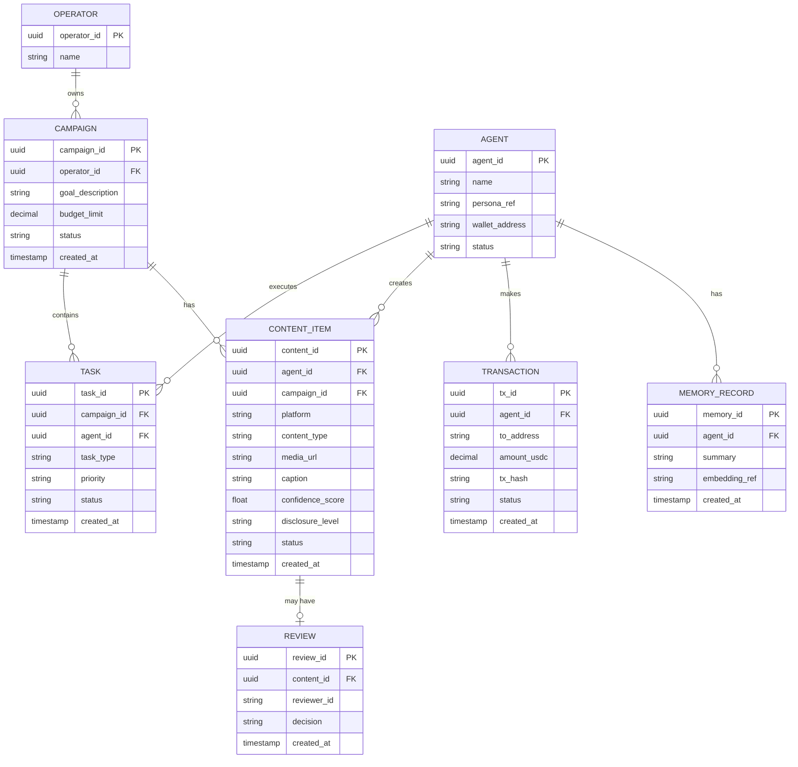

# Project Chimera — Master Specification: Technical

*This spec implements the decisions in [research/architecture_strategy.md](../research/architecture_strategy.md) and the vision in [specs/_meta.md](_meta.md).*

---

## Section 1 — API Contracts

The JSON messages passed between agents in the Planner–Worker–Judge swarm.

### (a) `AgentTask` — Planner → Worker

Issued by the Planner to assign a discrete unit of work to a Worker.

```json
{
  "task_id": "uuid",
  "task_type": "generate_content | reply_comment | execute_transaction",
  "priority": "high | medium | low",
  "context": {
    "goal_description": "string",
    "persona_constraints": ["string"],
    "required_resources": ["mcp://twitter/mentions/123"]
  },
  "assigned_worker_id": "string",
  "created_at": "timestamp",
  "status": "pending | in_progress | review | complete"
}
```

### (b) `WorkerResult` — Worker → Judge

Returned by a Worker once a task is executed, for scoring and gating by the Judge.

```json
{
  "result_id": "uuid",
  "task_id": "uuid",
  "worker_id": "string",
  "artifact": {
    "type": "text | image | video | transaction",
    "content": "string",
    "media_urls": ["string"]
  },
  "confidence_score": 0.0,
  "reasoning_trace": "string",
  "state_version": 0,
  "status": "success | failed"
}
```

### (c) MCP Tool Definition — example tool `post_content`

A Worker-invokable MCP Tool that publishes content to a connected social platform.

```json
{
  "name": "post_content",
  "description": "Publishes text and media to a connected social platform",
  "inputSchema": {
    "type": "object",
    "properties": {
      "platform": {
        "type": "string",
        "enum": ["twitter", "instagram", "threads"]
      },
      "text_content": {
        "type": "string"
      },
      "media_urls": {
        "type": "array",
        "items": { "type": "string" }
      },
      "disclosure_level": {
        "type": "string",
        "enum": ["automated", "assisted", "none"]
      }
    },
    "required": ["platform", "text_content"]
  }
}
```

> **Note:** Each schema maps to an immutable Java Record (DTO); the `state_version` field enables Optimistic Concurrency Control when the Judge commits a result.

---

## Section 2 — Database Schema (ERD)



### Persistence Note

Consistent with the polyglot-persistence decision in the architecture strategy:

- **High-velocity `CONTENT_ITEM` (video) metadata** is stored in a **NoSQL document store**, where its write-heavy load and platform-varying schema fit best.
- **`OPERATOR`, `CAMPAIGN`, `AGENT`, `TASK`, and `TRANSACTION`** live in **PostgreSQL** as the relational system of record, where referential integrity and transactional guarantees matter.
- **`MEMORY_RECORD` embeddings** live in **Weaviate** for semantic agent memory and vector search.

---

## Section 3 — Data Lifecycle: Migration, Transformation & Retrieval

### Migration

- The **PostgreSQL schema is version-controlled** with **forward-only, numbered migration scripts** (Flyway / Liquibase) under `db/migrations/`. Every schema change ships as a **new migration** — never an edit to an already-applied one.
- **NoSQL `CONTENT_ITEM` documents carry a `schema_version` field.** Readers **upgrade old documents lazily on access**, so platform-schema changes require **no downtime** and no bulk rewrite.

### Transformation

- A **raw Worker artifact** (from `WorkerResult`) is **validated**, then **normalized into a `CONTENT_ITEM`** — mapping `artifact.type` to `content_type` and extracting `media_urls`.
- **Monetary values are normalized to USDC decimal units** before a `TRANSACTION` row is written.
- For **agent memory**, a `CONTENT_ITEM` summary is passed through an **embedding model** to produce a vector, stored as a `MEMORY_RECORD` whose `embedding_ref` points at the **Weaviate** object.

### Retrieval (Key Access Patterns)

The main queries agents and the dashboard rely on:

| Consumer | Access pattern | Store |
| --- | --- | --- |
| **Planner** | Fetch `pending` `TASK`s for a campaign, ordered by `priority` then `created_at` | PostgreSQL |
| **Judge** | Fetch `CONTENT_ITEM` rows in `review` status by confidence threshold, for gating | NoSQL |
| **Agent memory** | Top-k vector similarity search to recall relevant past context | Weaviate |
| **Operator dashboard** | Paginated read of `CONTENT_ITEM` by `campaign_id` and `status` | NoSQL |
